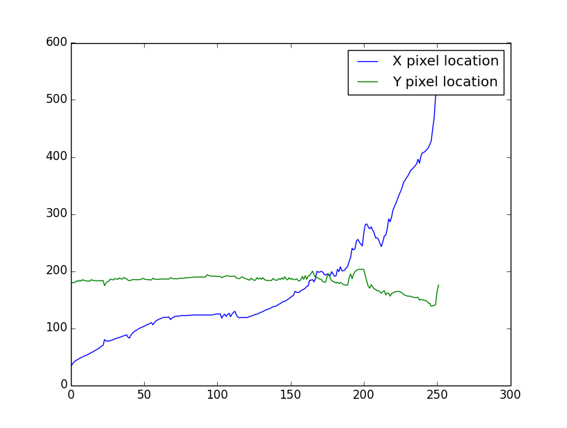
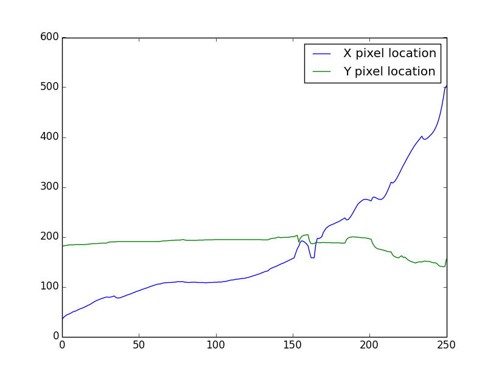
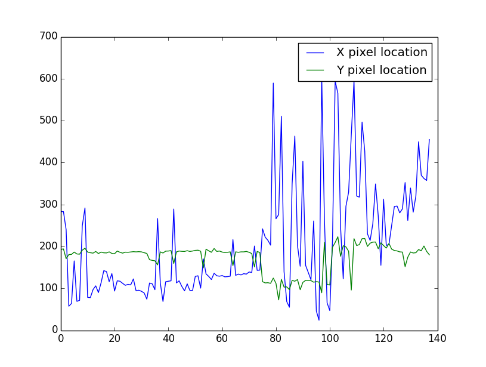

VOT 2014 Challenge
==================

Hello! This is a writeup of my thought process and solution attempts for the VOT 2014 Challenge.

I decided to use Python and OpenCV for the challenge, which was fun as I have never dabbled in OpenCV before, sticking to MATLAB for most school assignments. After looking at the files I decided to attempt the main challenge, which was:

"0. Where is the vehicle in subsequent frames of the video given the location in the first frame?"

An interesting problem with many potential angles of attack. I decided for my first attempt at tracking the vehicle I would use a feature detector to update a bounding box on each frame. This was contingent on the assumption that the initial car location and an accurate initial car bounding box was known.

ORB
---

I first used the [ORB](https://www.willowgarage.com/sites/default/files/orb_final.pdf) feature detector, which according to OpenCV is simply a combination of FAST and BRIEF. It worked well and was quite performant, particularly for Python. In each frame I updated the bounding box of the car by averaging the box corners with the maximum and minimum (x,y) pixel coordinates of the ORB features inside of the bounding box. This worked relatively well, although the box tended to disappear or distort when the car passed behind some foilage in the middle of the image sequence (a theme that was quite common as I tried other detectors and trackers...that damned foilage).

Lucas-Kanade Optical Flow
-------------------------

I wasn't very satisfied with ORB however, and decided to try [Lucas-Kanade optical flow](http://en.wikipedia.org/wiki/Lucas%E2%80%93Kanade_method), as we have just focused on it in my Computer Vision course, and implementing it in OpenCV is very easy. I used the same thought process as I had for ORB, starting with a known bounding box location and updating that bounding box with the feature points detected using the [Shi-Tomasi](http://www.ai.mit.edu/courses/6.891/handouts/shi94good.pdf) corner detection algorithm to periodically update detected corners coupled with LK optical flow tracking those points.

This method had similar performance to ORB in terms of accurately putting a bounding box around the car, although was noticeably faster (all of the gifs in this image are on 30FPS and do not accurately represent the running time of the programs used to create them).

I decided to branch out and try something different to track the car, as I was having difficulty tweaking the parameters so that the bounding box would fully contain the car at all points for the entirety of the video. I also decided to move away from assuming absolute knowledge of the car location and bounding box at the beginning of the video, as I feel like that is not going to be the case in a real-world car-tracking scenario.

HAAR Cascade Classifier
-----------------------

I considered using some kind of contour detection but after initial experiments with the image sequence it did not look promising. After some web searching I decided to use a [Haar Cascade classifier](http://en.wikipedia.org/wiki/Haar-like_features). Now, these classifiers need to be pre-trained and typically require a large amount of time and a very large dataset to come up with an accurate classifier. Fortunately I was able to find a pre-trained classifier XML file [here](https://code.google.com/p/opencv-lane-vehicle-track/). This classifier was designed for tracking cars in lanes however, and so I wasn't sure how accurate it might be with a rotating front- and then side-view of a car. I was right to be concerned, as the accuracy of the classifier was very suspect. Working alright at the beginning but then getting completely flummoxed by the end of the image sequence. I believe this also had to do with image size, as in the image sequence towards the end the car is a large portion of the screen and I do not believe the Haar classifier was trained on large images of the sides of cars. This algorithm was also pretty slow, noticeably more slow than either ORB or LK optical flow.

Dense Optical Flow
------------------

After the Haar Cascade fiasco, I went back to optical flow and decided to try out "Dense Optical Flow", which means that the optical flow is calculated for every single pixel in a frame. If this sounds slow, that is because it is. This algorithm was even slower than the Haar Cascade, although it created some mesmerizing results.

Conclusion
----------

At this point I decided not move further, as I had limited time remaining in the time alloted to do the challenge and think I have arrived at a decent stopping point. I attempted to graph the average bounding box positions of the ORB tracker, LK tracker, and Haar Cascade tracker, but the results are not exactly pretty:

ORB Tracker:

LK Tracker:

HAAR Tracker:

It is somewhat obvious that the ORB tracker and LK tracker were more accurate, as they have semi-smooth transitions whereas the Haar tracker jumped around all over the place.

Moving forward I would like to explore the dense optical flow algorithm more, moving from Python to C++ for improved speed. The car is somewhat visible in almost the entire visualization of the dense optical flow, and using some kind of clustering or connected components algorithm I think it might be possible to extract an accurate representation of a moving car at every point, regardless of camera motion.